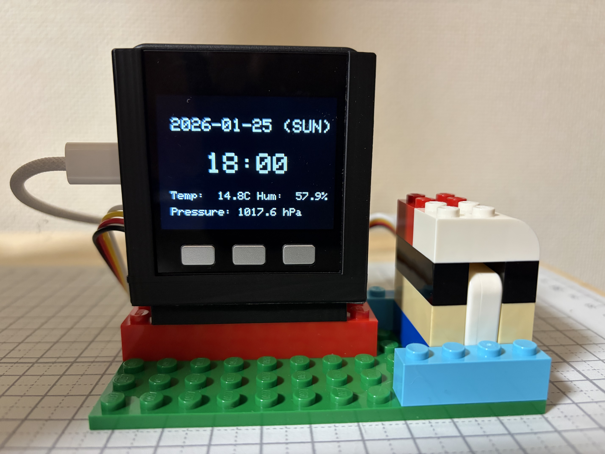
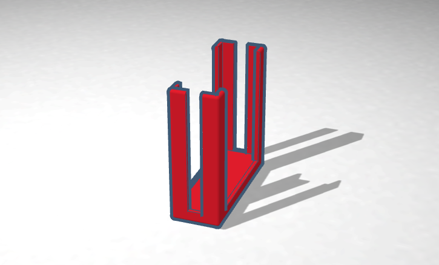
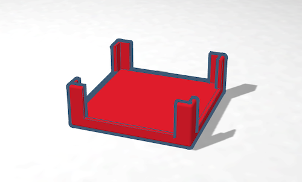
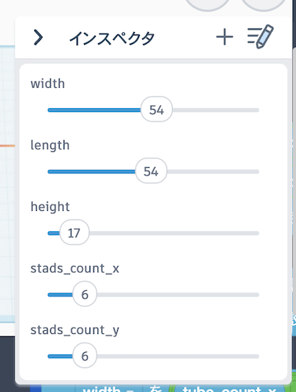

# M5Satck LEGOホルダー

M5StackなどのシングルボードコンピュータとLEGOブロックを接続するためのホルダーを製作しました。

LEGOブロックと組み合わせた電子工作をする時にご利用ください。変数で大きさを指定して作れますので、形状がフィットすればM5Stack以外のデバイスにも使えます。

### 利用例
こちらは、M5Stack BASICを縦置きにした時のサイズのホルダーとLEGOマウントを組み合わせてLEGOのプレートに接続したものです。

プロジェクトをTinkercadのコードブロックで作成し公開していますので、変数を変えることで様々な大きさのデバイスに対応できます。

文末にあるTinkercadのリンクを開いて、インスペクターで以下の変数を変更してください。

各変数の意味は以下の通りです、デバイスの大きさをそのまま設定してください。

| 変数名 | 意味 |
| :---: | --- |
| width | 横幅（単位：ミリメートル） |
| length | 奥行き（単位：ミリメートル） |
| height | 高さ（単位：ミリメートル） |
| stads_count_x | 接続するLEGOの突起の数（横幅方向） |
| stads_count_y | 接続するLEGOの突起の数（奥行き方向） |

### 応用
デバイスホルダーはM5Stackを想定したシンプルな形状なので、この形状では利用できないデバイスや基板などもあると思います。その場合はホルダー部分だけを別途作成してLEGOマウントと組み合わせてお使いください。

## データ
- [縦置きのデータ](/images/make/m5stack_lego/M5Stack_LEGO_holder_stand.stl)  
- [横置きのデータ](/images/make/m5stack_lego/M5Stack_LEGO_holder_flat.stl)  
- [プロジェクトを開く（Tinkercad）](https://www.tinkercad.com/codeblocks/5YaQmMsivOH-m5stack-holder)
