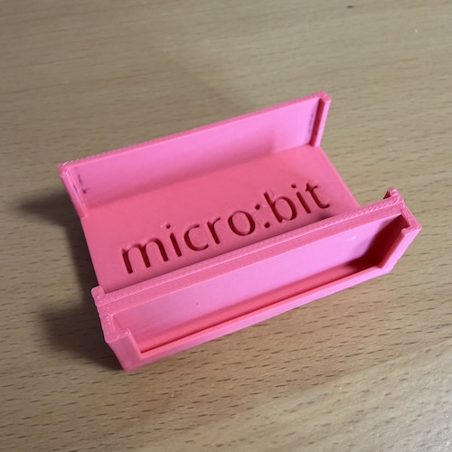
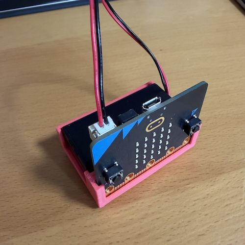
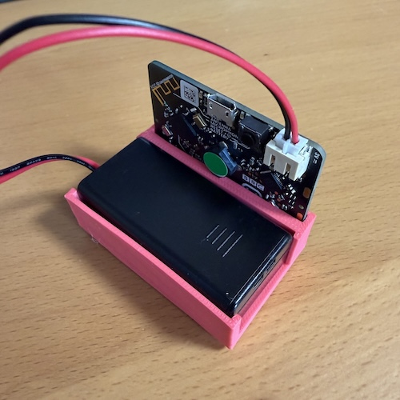

# micro:bit LEGOホルダー

micro:bitと電池ボックスをセットにするためのホルダーです。裏面はLEGOに接続できるようになっています。

電池ボックスは「micro:bit Go v2.2 マイクロビット スターターキット」に付属の単4電池2本、スイッチなしのものに対応しています。

[参考）micro:bit Go v2.2 マイクロビット スターターキット](https://www.marutsu.co.jp/pc/i/2195655/)

### 利用例

## データ
- [STLデータ](https://github.com/kwaka1208/make/blob/main/microbit_lego/microbit%2Bbattery_holder_noswitch.stl)
- [プロジェクトを開く（Tinkercad）](https://www.tinkercad.com/codeblocks/jrAOePfwhzF-microbitbatteryholdernoswitch)
